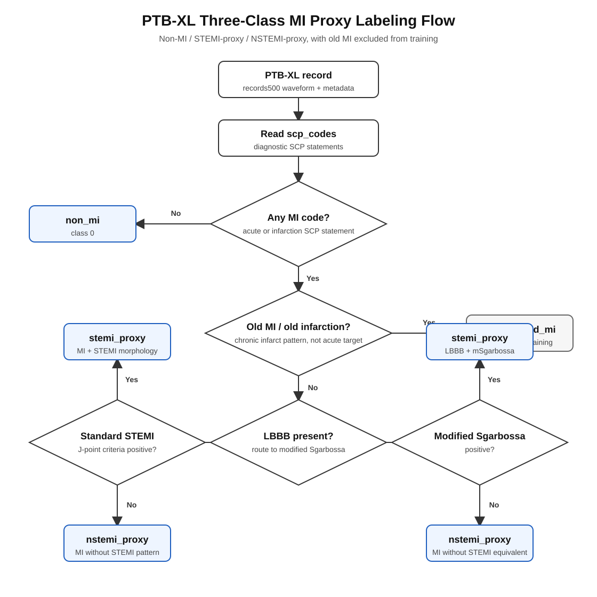

# Miclass3

`Miclass3` is a reproducible 12-lead ECG research project for three PTB-XL proxy classes, using raw 500 Hz (`records500`) signals:

1. `non_mi` — no diagnostic MI SCP statement.
2. `stemi_proxy` — MI SCP statement plus contiguous J-point STEMI morphology, or LBBB with positive modified Sgarbossa.
3. `nstemi_proxy` — MI SCP statement without a STEMI-equivalent pattern.

The third class is deliberately named **NSTEMI-proxy** in code and reporting. PTB-XL does not contain serial troponin, symptoms, coronary angiography, or adjudicated encounter diagnoses, so it cannot establish clinical NSTEMI. See [the full label specification](docs/label_specification.md).



## Architecture

```text
records500 ECG ──> 12-lead normalization ──> selected neural encoder ──> 3 proxy classes
                         │
                         └─> J-point / ST-S / QRS evidence ──> fusion model + auxiliary heads
```

The project intentionally keeps only three strong candidates:

| Model | Use | Why it is included |
|---|---|---|
| `morphology_fusion` | Primary | SE-ResNet waveform encoder fused with auditable continuous J-point, ST/S, and QRS-duration features. Direct LBBB/mSgarbossa routing flags are withheld from the primary classifier. |
| `inceptiontime` | Independent high-capacity comparison | Parallel receptive fields capture narrow QRS and slower ST/T morphology without handcrafted fusion. |
| `seresnet` | Robust waveform baseline | Residual multi-scale representation with squeeze-excitation learns lead importance and is easier to calibrate. |

This is not an architecture sweep. Train `morphology_fusion` first; train the two others only as independent checks that the result is not architecture-specific.

## Install

```bash
git clone https://github.com/ntu-b12505041/Miclass3.git
cd Miclass3
python -m venv .venv
.venv\\Scripts\\activate
pip install -r requirements.txt
pip install -e .
```

## Build labels

The initial command downloads only PTB-XL metadata. Without morphology input it still produces a valid, conservative first manifest, but no record is promoted to `stemi_proxy` until the J-point/LBBB table is supplied.

The recommended path is to extract morphology directly from PTB-XL `records500` first:

```bash
python scripts/extract_morphology.py --data-dir data/ptbxl --out data/morphology_features.csv --beats-out data/morphology_beats.csv --label-out data/label_manifest.csv
```

To compare fiducial detectors without changing label rules, run separate manifests:

```bash
python scripts/extract_morphology.py --data-dir data/ptbxl --backend neurokit --out data/morphology_features_neurokit.csv --beats-out data/morphology_beats_neurokit.csv --label-out data/label_manifest_neurokit.csv
python scripts/extract_morphology.py --data-dir data/ptbxl --backend ecgdeli --ecgdeli-fiducials data/ecgdeli_fiducials.csv --out data/morphology_features_ecgdeli.csv --beats-out data/morphology_beats_ecgdeli.csv --label-out data/label_manifest_ecgdeli.csv
```

`--backend` changes only P-QRS-T/fiducial point acquisition. The primary LBBB route uses a positive LBBB entry in `scp_codes`; `--lbbb-source either` and `raw` are sensitivity analyses only. Old MI is excluded only for `Stadium III`, while the ambiguous transition category `Stadium II-III` remains in the primary cohort.

This writes the record-level morphology table, a beat-level P-QRS-T/J-point audit table, and the final training label manifest. See [the morphology extractor guide](docs/morphology_extractor.md).

```bash
python scripts/build_labels.py --data-dir data/ptbxl --out data/label_manifest.csv
python scripts/build_labels.py --data-dir data/ptbxl --morphology-csv data/morphology_features.csv --out data/label_manifest.csv
```

`morphology_features.csv` needs one row per `ecg_id`; required columns are `standard_stemi`, `lbbb`, and `modified_sgarbossa_positive`. Recommended auxiliary columns are `max_st_j_mv`, `max_st_j60_mv`, `max_st_s_ratio`, and `qrs_duration_ms`.

## Train

PTB-XL waveform files are not redistributed. Download the official `records500` tree under `data/ptbxl/records500/` first, accepting the PhysioNet terms. Then run one model:

```bash
python scripts/train.py --model morphology_fusion --device cuda
```

For a CPU pipeline check only:

```bash
python scripts/train.py --model seresnet --device cpu --max-records 300
```

## All-metric tuning

To target a minimum of `0.85` for accuracy, balanced accuracy, macro-AUROC,
macro-AUPRC, macro-F1, and STEMI-proxy recall, run the predefined
validation-only candidates:

```bash
python scripts/tune.py --device cuda --out-dir artifacts/tuning_085 --finalize
```

Each candidate is trained on folds 1-8 and evaluated on fold 9 with
`--skip-test`. `validation_leaderboard.csv` ranks candidates by their weakest
required metric, so a high AUPRC cannot hide a weak balanced accuracy or STEMI
recall. Fold 10 is evaluated only once after a candidate reaches every
validation target. Inspect `selection.json`; `test_passes_target: true` is the
required evidence that the final selected run meets the target on the held-out
test fold. Candidate settings and the 0.85 threshold live in
`configs/tuning.yaml`.

For VS Code GPU setup, see [the GPU training guide](docs/vscode_gpu_training.md).

For AI coding agents, start with [the AI agent runbook](docs/ai_agent_runbook.md). It gives the exact order for data checks, raw ECG morphology extraction, label manifest creation, GPU smoke testing, full training, and results reporting.

For the corrected IECBES 2026 label audit and complete pre-specified run matrix,
use [the corrected experiment protocol](docs/iecbes2026_corrected_protocol.md).

The model is selected on fold 9 macro-AUPRC and evaluated once on fold 10. Every completed training run writes a complete results bundle under `artifacts/`:

- `train|val|test_metrics.json`: accuracy, balanced accuracy, macro-AUROC, macro-AUPRC, macro-F1, STEMI-proxy recall, sample count, and the raw confusion matrix.
- `train|val|test_classification_report.csv`: precision, recall/sensitivity, specificity, F1, and support for each class.
- `train|val|test_confusion_matrix.csv` and `.png`: labelled numerical and publication-ready confusion matrices.
- `train|val|test_predictions.csv`: every prediction, the three probabilities, and ECG/patient/fold identifiers for audit.
- `best_model.pt` and `metrics.json`: selected model state, epoch history, imbalance settings, calibrated threshold, and training timing.
- `val_stemi_threshold_candidates.csv`: every validation-only STEMI threshold candidate, including macro-F1, balanced accuracy, and STEMI-proxy recall.

The default configuration first takes a deterministic training-only subsample
of `non_mi`, capped at 2:1 relative to `nstemi_proxy`, to reduce the observed
non-MI/NSTEMI-proxy confusion. Validation and test records are untouched. It
then uses moderate square-root class-aware sampling, softened
inverse-frequency loss weights, and weighted MI/STEMI auxiliary losses. A
Morphology features are robustly scaled using folds 1-8 only (with explicit
missingness flags) before fusion. The learning rate is reduced only after
validation macro-AUPRC plateaus. The STEMI decision threshold is calibrated on
fold 9 by macro-F1 and frozen before fold 10 evaluation; the before/after
training counts and calibration values are recorded in `metrics.json`. If
STEMI sensitivity is the operational priority, set
`metrics.stemi_threshold.minimum_stemi_recall` for a separate comparison run;
do not select that floor from fold 10.

The morphology-fusion model also has light hierarchy tasks for MI-vs-non-MI
and STEMI-vs-non-STEMI, plus the LBBB auxiliary task. These strengthen the
relevant boundaries and conduction-pattern representation; none is a separate
clinical endpoint.

Never report the test result as clinical NSTEMI diagnostic accuracy.

## Research safeguards

- Patient-level official PTB-XL folds are retained.
- PTB-XL `Stadium III` MI is excluded rather than silently relabeled as NSTEMI-proxy; `Stadium II-III` is retained as an explicitly acknowledged ambiguous transition category.
- SCP-coded LBBB is routed through modified Sgarbossa, not ordinary ST elevation rules; the simplified raw-LBBB rule is sensitivity-only.
- Direct LBBB and modified-Sgarbossa routing flags are excluded from the primary classifier inputs.
- Morphology evidence remains in the label manifest, so every label is auditable.
- A future hospital cohort with serial hs-cTn and adjudication must be used for clinical validation before any diagnostic claim.

## References

- [PTB-XL dataset](https://physionet.org/content/ptb-xl/1.0.3/)
- [PTB-XL publication](https://doi.org/10.1038/s41597-020-0495-6)
- [Fourth Universal Definition of MI](https://doi.org/10.1016/j.jacc.2018.08.1038)
- [Modified Sgarbossa derivation](https://doi.org/10.1016/j.annemergmed.2012.07.119)
- [Modified Sgarbossa validation](https://doi.org/10.1016/j.ahj.2015.09.016)
